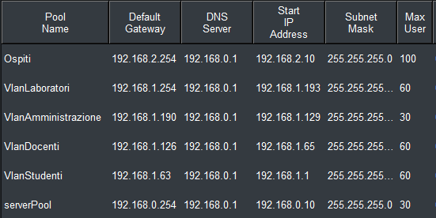

# Configurazioni

# Switch L3
### EtherChannel (Port-Channel 1)

```bash
interface Port-channel1
 switchport mode trunk

interface FastEthernet0/2
 switchport mode trunk
 channel-group 1 mode active

interface FastEthernet0/3
 switchport mode trunk
 channel-group 1 mode active
```

---
<br>

### Trunk verso altri dispositivi

```bash
interface FastEthernet0/1
 switchport mode trunk
```

---

### Uplink router

```bash
interface GigabitEthernet0/2
 ip address 10.0.0.6 255.255.255.252
```

---

### VLAN e rispettivi Gateway

#### VLAN 10 – Studenti
```bash
interface Vlan10
 ip address 192.168.1.62 255.255.255.192
 ip helper-address 192.168.0.1
```

#### VLAN 20 – Docenti
```bash
interface Vlan20
 ip address 192.168.1.126 255.255.255.192
 ip helper-address 192.168.0.1
```

#### VLAN 30 – Amministrazione
```bash
interface Vlan30
 ip address 192.168.1.190 255.255.255.192
 ip helper-address 192.168.0.1
```

#### VLAN 40 – Laboratori
```bash
interface Vlan40
 ip address 192.168.1.254 255.255.255.192
 ip helper-address 192.168.0.1
```

---

### Routing

```bash
ip route 0.0.0.0 0.0.0.0 10.0.0.5
```

---

### ACL

#### ACL Studenti
```bash
ip access-list extended STUDENTI_OUT
 deny ip 192.168.1.0 0.0.0.63 192.168.1.128 0.0.0.63
 deny ip 192.168.1.0 0.0.0.63 192.168.2.0 0.0.0.255

```

#### ACL Docenti
```bash
ip access-list extended DOCENTI_OUT
 deny ip 192.168.1.64 0.0.0.63 192.168.2.0 0.0.0.255
  
```

#### ACL Amministrazione
```bash
ip access-list extended AMMINISTRAZIONE_OUT
 deny ip 192.168.1.128 0.0.0.63 192.168.2.0 0.0.0.255
  
```

#### ACL Laboratori
```bash
ip access-list extended LAB_OUT
 deny ip 192.168.1.192 0.0.0.63 192.168.1.128 0.0.0.63
 deny ip 192.168.1.192 0.0.0.63 192.168.2.0 0.0.0.255
  
```


---

<br><br><br>

# Router – LAN Aule e Laboratori

## Interfacce

### Collegamento verso Switch L3
```bash
interface GigabitEthernet0/0
 ip address 10.0.0.5 255.255.255.252
```

### Uplink verso Router principale
```bash
interface FastEthernet5/0
 ip address 10.0.0.2 255.255.255.252
```
---

## Routing statico

```bash
ip route 192.168.1.0 255.255.255.192 10.0.0.6
ip route 192.168.1.64 255.255.255.192 10.0.0.6
ip route 192.168.1.128 255.255.255.192 10.0.0.6
ip route 192.168.1.192 255.255.255.192 10.0.0.6
ip route 0.0.0.0 0.0.0.0 10.0.0.1
```

---
<br><br><br>

# Router Principale – Configurazione

## Interfacce

### LAN Amministrazione
```bash
interface GigabitEthernet0/0
 ip address 192.168.0.254 255.255.255.0
```

### Collegamento verso DMZ/Internet
```bash
interface GigabitEthernet1/0
 ip address 172.16.0.2 255.255.255.252
```

### Collegamento verso Router Aule/Laboratori
```bash
interface FastEthernet5/0
 ip address 10.0.0.1 255.255.255.252
```

### Collegamento verso Router Ospiti
```bash
interface FastEthernet4/0
 ip address 10.0.0.9 255.255.255.252
```

---

## Routing statico

```bash
ip route 192.168.1.0 255.255.255.0 10.0.0.2
ip route 192.168.2.0 255.255.255.0 10.0.0.10
ip route 192.168.100.0 255.255.255.0 172.16.0.1
ip route 0.0.0.0 0.0.0.0 172.16.0.1
```

---
<br><br><br>

# Router – LAN Ospiti

## Informazioni generali

## Interfacce

### LAN Ospiti
```bash
interface GigabitEthernet3/0
 ip address 192.168.2.254 255.255.255.0
 ip helper-address 192.168.0.1
```

### Collegamento verso Router Principale
```bash
interface FastEthernet5/0
 ip address 10.0.0.10 255.255.255.252
```
---

## Routing statico

```bash
ip route 0.0.0.0 0.0.0.0 10.0.0.9
```

<br><br>

# Configurazione server DHCP




<br><br><br>

# ASA – Configurazione Firewall per DMZ

## Interfacce

### Outside (verso Rete esterna)
```bash
interface GigabitEthernet1/1
 nameif outside
 security-level 0
 ip address 10.0.0.1 255.255.255.252
```

### DMZ (Server Web/Posta)
```bash
interface GigabitEthernet1/2
 nameif dmz
 security-level 50
 ip address 192.168.100.1 255.255.255.0
```

### Inside (verso LAN Amministrazione)
```bash
interface GigabitEthernet1/3
 nameif inside
 security-level 100
 ip address 172.16.0.1 255.255.255.252
```
---

## NAT

### NAT dinamico per la rete interna
```bash
object network INSIDE-NAT
 subnet 192.168.0.0 255.255.0.0
 nat (inside,outside) dynamic interface
```

### NAT statico per server web in DMZ
```bash
object network WEB-SITE
 host 192.168.100.10
 nat (dmz,outside) static 200.200.200.1
```

---

## Routing

```bash
route outside 0.0.0.0 0.0.0.0 10.0.0.2 1
route inside 192.168.0.0 255.255.255.0 172.16.0.2 1
route inside 192.168.1.0 255.255.255.0 172.16.0.2 1
route inside 192.168.2.0 255.255.255.0 172.16.0.2 1
```

---

## ACL

### Traffico in ingresso da Outside
```bash
access-list OUTSIDE_IN extended permit ip any host 192.168.100.10
access-list OUTSIDE_IN extended permit tcp any host 200.200.200.1 eq www
access-list OUTSIDE_IN extended permit tcp any host 200.200.200.1 eq 443
```

### Traffico in ingresso dalla DMZ
```bash
access-list DMZ_IN extended permit icmp 192.168.100.0 255.255.255.0 any echo-reply
access-list DMZ-IN extended permit tcp host 192.168.100.10 192.168.0.0 255.255.255.0 eq smtp
access-list DMZ-IN extended permit tcp host 192.168.100.10 192.168.0.0 255.255.255.0 eq pop3
access-list DMZ-IN extended permit tcp host 192.168.100.10 192.168.0.0 255.255.255.0 eq 143
```

### Applicazione ACL alle interfacce
```bash
access-group OUTSIDE_IN in interface outside
access-group DMZ-IN in interface dmz
```

