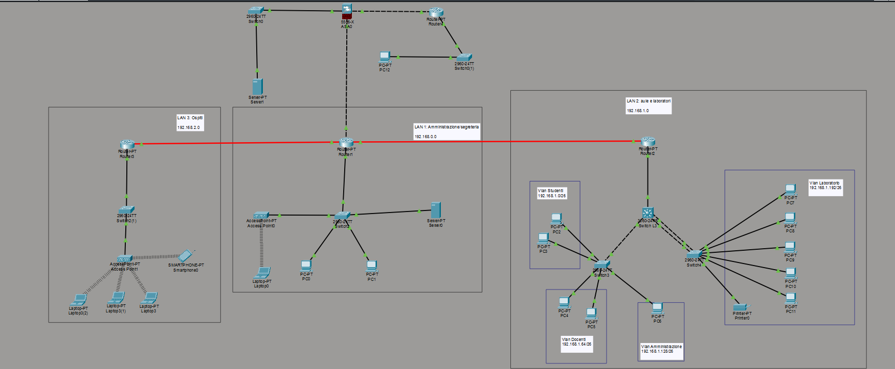

# Progetto Rete Scolastica – Nicolò Ranieri

## 1. Obiettivo del progetto

Definire un'architettura di rete che comprenda più reti locali interconnesse a livello IP.
Definire servizi di connettività locale (es.: VLAN) e IP.
Simulare il funzionamento della rete tramite Cisco Packet Tracer.

## 2. Topologia di Rete

La rete è composta da 3 LAN separate tra loro che rappresentano ognuna una sezione fisica di un edificio scolastico:

#### LAN 1: Amministrazione 
Usata dai dirigenti per il loro lavoro e luogo in cui troviamo il server dhcp e dns della scuola.

#### LAN 2: Aule e Laboratori
Usata dagli studenti ed i docenti per le attività scolastiche.

#### LAN 3: Ospiti
Usata per permettere a persone che non appartengono al contesto scolastico, ma in visita presso la struttura, di connettersi ad internet.

## 3. Scelta del Cablaggio

Nel progetto ho adottato una struttura di cablaggio coerente con le reti scolastiche e aziendali moderne, bilanciando prestazioni, costi e realismo.
- Il collegamento tra router è realizzato in fibra ottica, dato che sono i dispositivi che devono gestire il maggior traffico e la fibra ottica, grazie alla sua elevata banda, bassa latenza e immunità alle interferenze è la scelta perfetta.
- Il collegamento tra router e switch principali utilizza Gigabit Ethernet, che garantisce comunque throughput abbastanza elevato e stabile per la distribuzione del traffico tra le VLAN e verso la rete interna.
- Infine, la connessione tra switch e dispositivi finali (PC, stampanti, access point) è stata realizzata tramite FastEthernet, una soluzione economica e adeguata per le esigenze dei client.

## 4. Indirizzamento IP
| NETWORK                | Subnet              | Gateway           | Descrizione             |
|------------------------|---------------------|-------------------|-------------------------|
| Vlan Studenti          | 192.168.1.0/26      | 192.168.1.63      | Rete studenti           |
| Vlan Docenti           | 192.168.1.64/26     | 192.168.1.126     | Rete docenti            |
| Vlan Amministrazione   | 192.168.1.128/26    | 192.168.1.190     | Rete amministrazione    |
| Vlan Laboratori        | 192.168.1.192/26    | 192.168.1.254     | Laboratori informatici  |
| LAN Ospiti             | 192.168.2.0/24      | 192.168.2.254     | Rete ospiti Wi‑Fi       |
| LAN Amministrazione    | 192.168.0.0/24      | 192.168.0.254     | Server amministrativi   |

## 5. Servizi implementati

- **DHCP relay:** implementato sul server `192.168.0.1` nella LAN Amminstrazione
- **DNS:** implementato sul server `192.168.0.1` nella LAN Amminstrazione
- **NAT:** svolto dall'asa che traduce tutti gli indirizzi che escono dalla rete della scuola in `10.0.0.1`
- **DMZ:** implementato tramite l'asa e permette di ospitare un server accessibile dall'esterno mantenendo protetta la rete interna
- **ACL inter-VLAN:** per evitare che alcune VLAN si parlino tra loro (es. studenti -> amministrazione)
- **EtherChannel:** necessario per garantire continuità del servizio anche in caso di guasti ad un cavo

## 6. Test e validazione
- Ping riusciti
- Ping bloccati
- NAT verificato
- EtherChannel attivo

## 7. File del progetto
- Packet Tracer (.pkt)
- Configurazioni (.txt)
