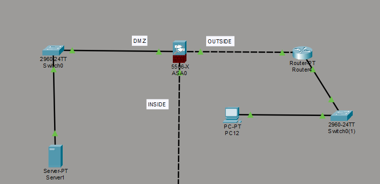
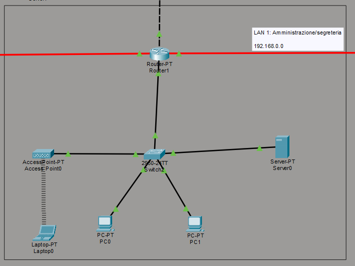
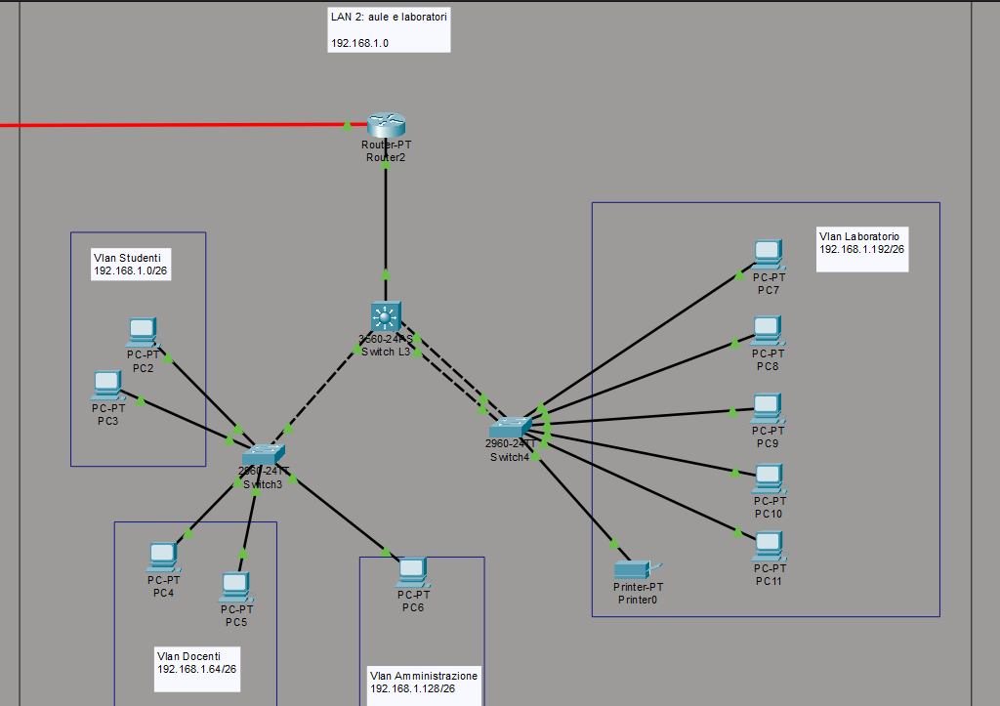
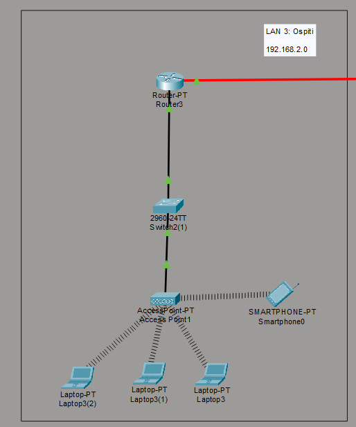
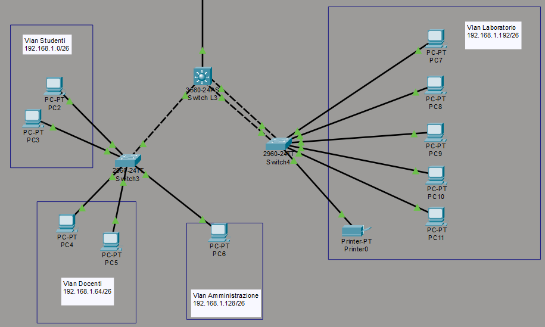
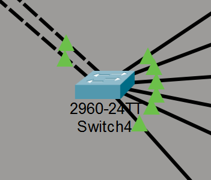
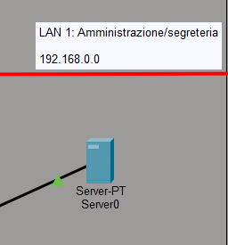
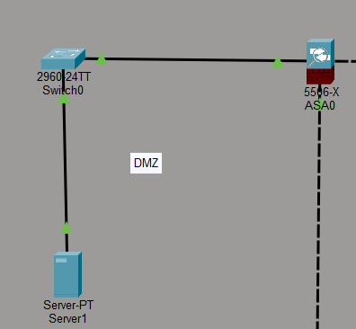
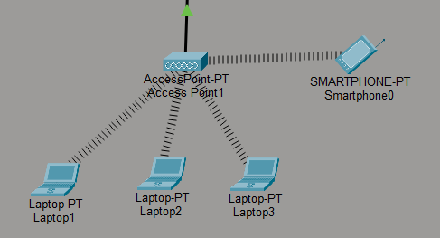
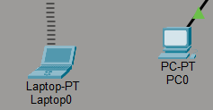

# Progetto Rete Scolastica – Nicolò Ranieri

## 1. Obiettivo del progetto

Definire un'architettura di rete che comprenda più reti locali interconnesse a livello IP.
Definire servizi di connettività locale (es.: VLAN) e IP.
Simulare il funzionamento della rete tramite Cisco Packet Tracer.

## 2. Topologia di Rete

La rete è composta da 3 LAN separate tra loro che rappresentano ognuna una sezione fisica di un edificio scolastico:

#### LAN 1: Amministrazione 
Usata dai dirigenti per il loro lavoro e luogo in cui troviamo il server dhcp e dns della scuola.

#### LAN 2: Aule e Laboratori
Usata dagli studenti ed i docenti per le attività scolastiche.

#### LAN 3: Ospiti
Usata per permettere a persone che non appartengono al contesto scolastico, ma in visita presso la struttura, di connettersi ad internet.

## 3. Scelta del Cablaggio

Nel progetto ho adottato una struttura di cablaggio coerente con le reti scolastiche e aziendali moderne, bilanciando prestazioni, costi e realismo.
- Il collegamento tra router è realizzato in fibra ottica, dato che sono i dispositivi che devono gestire il maggior traffico e la fibra ottica, grazie alla sua elevata banda, bassa latenza e immunità alle interferenze è la scelta perfetta.
- Il collegamento tra router e switch principali utilizza Gigabit Ethernet, che garantisce comunque throughput abbastanza elevato e stabile per la distribuzione del traffico tra le VLAN e verso la rete interna.
- Infine, la connessione tra switch e dispositivi finali (PC, stampanti, access point) è stata realizzata tramite FastEthernet, una soluzione economica e adeguata per le esigenze dei client.

## 4. Lista dei Dispositivi utilizzati

Di seguito la lista completa dei dispositivi impiegati nel progetto e le funzioni che svolgono:

  

    <h3>ASA 5506-X – Firewall Perimetrale</h3>
    

      L’ASA 5506-X viene utilizzato come firewall perimetrale. Si occupa di separare la rete interna da Internet,
      gestire la DMZ, applicare NAT statico e dinamico e filtrare il traffico tramite ACL dedicate.
    

  

  

    
  

---

  

    <h3>Router Principale (Router-PT)</h3>
    

      Il router principale rappresenta il punto centrale dell’intera infrastruttura di rete. Collega tra loro l’ASA, 
      la LAN amministrativa, la rete ospiti e la rete delle aule e dei laboratori.
      Gestisce il routing statico tra le 3 LAN e agisce come default gateway verso l’ASA, permettendo alla rete interna di raggiungere Internet in modo controllato e sicuro.
    

  

  

    
  

---

  

    <h3>Router Aule/Laboratori (Router-PT)</h3>
    

      Il router dedicato alle aule e ai laboratori collega lo switch L3 al resto dell’infrastruttura e gestisce 
      il routing verso le VLAN didattiche.
    

  

  

    
  

---

  

    <h3>Router Ospiti (Router-PT)</h3>
    

      Il router della rete ospiti gestisce la LAN dedicata ai dispositivi esterni al contesto scolastico. Applica una default route verso il router principale e permettendo cosi la connessione ad internet anche agli ospiti della struttura 
    

  

  

    
  

---

  

    <h3>Switch L3 (Cisco 3560)</h3>
    

      Lo switch L3 rappresenta il cuore della LAN aule e laboratori. Gestisce tutte le VLAN, fornisce routing inter‑VLAN e applica ACL per segmentare il traffico tra le diverse reti. Inoltre, utilizza 
      un EtherChannel verso gli switch access per aumentare banda e ridondanza, garantendo stabilità all'interno della LAN.
    

  

  

    
  

---

  

    <h3>Switch L2 (Cisco 2960)</h3>
    

      Gli switch L2 costituiscono il livello di accesso della rete. Collegano PC, server e dispositivi finali, 
      assegnano le VLAN appropriate e mantengono i trunk verso lo switch L3. Sono responsabili della distribuzione 
      del traffico all’interno delle VLAN e rappresentano il punto di ingresso fisico alla rete per la maggior parte 
      dei dispositivi.
    

  

  

    
  

---

  

    <h3>Server DHCP / DNS</h3>
    

      Il server DHCP/DNS fornisce servizi fondamentali per il funzionamento della rete. Si occupa di distribuire 
      automaticamente gli indirizzi IP alle varie VLAN e gestisce la risoluzione dei nomi interni, permettendo ai 
      dispositivi di comunicare in modo semplice.
    

  

  

    
  

---

  

    <h3>Server nella DMZ</h3>
    

      Il server collocato nella DMZ ospita il sito pubblico e gestisce i servizi di posta elettronica tramite SMTP, 
      POP3 e IMAP. È raggiungibile da Internet tramite NAT statico configurato sull’ASA, ma rimane isolato dalla 
      rete interna per motivi di sicurezza.
    

  

  

    
  

---

  

    <h3>Access Point</h3>
    

      Gli Access Point forniscono connettività wireless alle reti interne e alla rete ospiti. Permettono ai dispositivi 
      mobili e laptop di accedere alle VLAN corrette tramite SSID dedicati.
    

  

  

    
  

---

  

    <h3>PC, Laptop e Dispositivi Finali</h3>
    

      I PC, i laptop e gli altri dispositivi finali sono stati utilizzati per verificare il corretto funzionamento 
      dell’infrastruttura. Questi dispositivi rappresentano il punto di vista dell’utente finale e sono fondamentali per validare l’intero progetto.
    

  

  

    
  

## 5. Indirizzamento IP
| NETWORK                | Subnet              | Gateway           | Descrizione             |
|------------------------|---------------------|-------------------|-------------------------|
| Vlan Studenti          | 192.168.1.0/26      | 192.168.1.63      | Rete studenti           |
| Vlan Docenti           | 192.168.1.64/26     | 192.168.1.126     | Rete docenti            |
| Vlan Amministrazione   | 192.168.1.128/26    | 192.168.1.190     | Rete amministrazione    |
| Vlan Laboratori        | 192.168.1.192/26    | 192.168.1.254     | Laboratori informatici  |
| LAN Ospiti             | 192.168.2.0/24      | 192.168.2.254     | Rete ospiti Wi‑Fi       |
| LAN Amministrazione    | 192.168.0.0/24      | 192.168.0.254     | Server amministrativi   |

## 6. Servizi implementati

- **DHCP relay:** implementato sul server `192.168.0.1` nella LAN Amminstrazione
- **DNS:** implementato sul server `192.168.0.1` nella LAN Amminstrazione
- **NAT:** svolto dall'asa che traduce tutti gli indirizzi che escono dalla rete della scuola in `10.0.0.1`
- **DMZ:** implementato tramite l'asa e permette di ospitare un server accessibile dall'esterno mantenendo protetta la rete interna
- **ACL inter-VLAN:** per evitare che alcune VLAN si parlino tra loro (es. studenti -> amministrazione)
- **EtherChannel:** necessario per garantire continuità del servizio anche in caso di guasti ad un cavo

##### configurazioni complete e test di connettività sono illustrati nei relativi file delle repository
